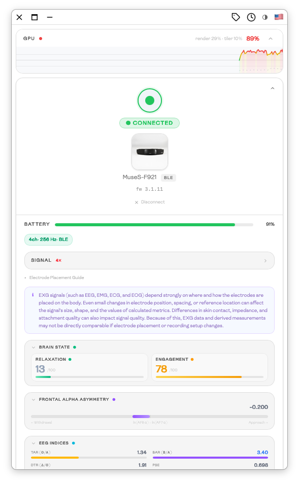
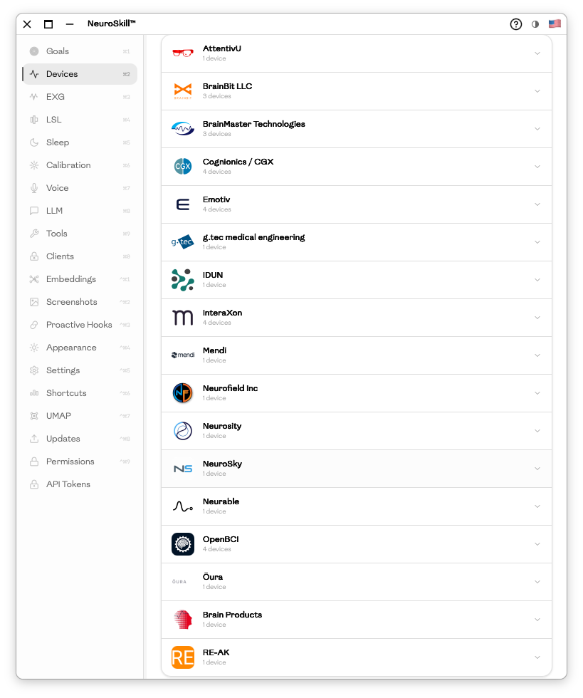

# NeuroSkill™

[www.neuroskill.com](https://neuroskill.com)

[](https://github.com/NeuroSkill-com/skill/releases/latest)
[](https://github.com/NeuroSkill-com/skill/blob/main/LICENSE)
[](https://discord.gg/Rcvb8Cx4cZ)

> ⚠️ **Research use only — not a medical device.**
> NeuroSkill is an open-source EXG/BCI research tool. It is not FDA/CE approved and must not be used for diagnosis or treatment.

NeuroSkill is a local-first desktop neurofeedback + BCI app built with **Tauri v2 (Rust)** and **SvelteKit**.

<p align="center">
  
  
</p>

## Quick links

- **Downloads:** [macOS](https://github.com/NeuroSkill-com/skill/releases/latest/download/NeuroSkill.dmg) · [Windows](https://github.com/NeuroSkill-com/skill/releases/latest/download/NeuroSkill.exe) · [Linux](https://github.com/NeuroSkill-com/skill/releases/latest/download/NeuroSkill.AppImage)
- **Install (Homebrew):** `brew tap NeuroSkill-com/skill && brew install --cask neuroskill`
- **Contributing:** [CONTRIBUTING.md](CONTRIBUTING.md)
- **Changelog:** [CHANGELOG.md](CHANGELOG.md)

## What it does

- Real-time EXG streaming and visualization
- GPU band-power analysis + neural embeddings
- Session comparison, sleep staging, and UMAP visualization
- Labeling, similarity search, and screenshot-based search
- Local LLM + TTS integration
- LSL + remote rlsl-iroh streaming
- WebSocket/HTTP API

## Supported devices

<!-- AUTO-GENERATED:SUPPORTED_DEVICES:START -->
<!-- Run: npm run sync:readme:supported -->
- **AttentivU:** AttentivU Glasses *(iOS bridge only)*
- **BrainBit LLC:** BrainBit, BrainBit 2, BrainBit Flex 4/8
- **BrainMaster Technologies:** Atlantis 4×4 (4-ch), Discovery (24-ch), Freedom (24-ch wireless)
- **Cognionics / CGX:** Quick-20r, Quick-32r, Quick-8r, AIM-2
- **Emotiv:** EPOC X, FLEX Saline, Insight, MN8
- **g.tec medical engineering:** Unicorn Hybrid Black
- **IDUN:** Guardian
- **InteraXon:** Muse 2016, Muse 2, Muse S, Muse S Athena
- **Mendi:** Mendi Headband
- **Neurofield Inc:** Q21 (20-ch)
- **Neurosity:** Crown / Notion
- **NeuroSky:** MindWave / MindWave Mobile
- **Neurable:** MW75 Neuro
- **OpenBCI:** Cyton, Cyton Daisy, Galea, Ganglion
- **Ōura:** Oura Ring (Gen 3 / Gen 4)
- **Brain Products:** BrainVision RDA
- **RE-AK:** Nucleus-Hermès

Plus any compatible **LSL** source (e.g. BrainFlow, MATLAB, pylsl).
<!-- AUTO-GENERATED:SUPPORTED_DEVICES:END -->

## Supported EXG/BCI foundation models

Canonical source: `src-tauri/exg_catalog.json`

<!-- AUTO-GENERATED:SUPPORTED_MODELS:START -->
<!-- Run: npm run sync:readme:supported -->
- **ZUNA** (`Zyphra/ZUNA`)
- **LUNA Base** (`PulpBio/LUNA`)
- **LUNA Large** (`PulpBio/LUNA`)
- **LUNA Huge** (`PulpBio/LUNA`)
- **REVE Base** (`brain-bzh/reve-base`)
- **REVE Large** (`brain-bzh/reve-large`)
- **OpenTSLM** (`StanfordBDHG/OpenTSLM`)
- **SensorLM** (`google/sensorlm`)
- **SleepFM** (`zou-group/sleepfm-clinical`)
- **SleepLM** (`yang-ai-lab/SleepLM`)
- **OSF Base** (`yang-ai-lab/OSF-Base`)
- **SignalJEPA** (`braindecode/SignalJEPA-PreLocal-pretrained`)
- **LaBraM** (`braindecode/labram-pretrained`)
- **EEGPT** (`braindecode/eegpt-pretrained`)
- **TRIBE v2** (`eugenehp/tribev2`)
- **NeuroRVQ** (`eugenehp/NeuroRVQ`)
- **CBraMod** (`braindecode/cbramod-pretrained`)
- **ST-EEGFormer Small** (`eugenehp/ST-EEGFormer`)
- **ST-EEGFormer Base** (`eugenehp/ST-EEGFormer`)
- **ST-EEGFormer Large** (`eugenehp/ST-EEGFormer`)
<!-- AUTO-GENERATED:SUPPORTED_MODELS:END -->

## Documentation

Long-form documentation lives in `./docs`:

- Docs index: [docs/README.md](docs/README.md)
- Architecture overview: [docs/architecture.md](docs/architecture.md)
- Device support and integration notes: [docs/DEVICES.md](docs/DEVICES.md)
- UI notes: [docs/UI.md](docs/UI.md)
- Metrics reference and formulas: [docs/METRICS.md](docs/METRICS.md)
- Hooks: [docs/HOOKS.md](docs/HOOKS.md)
- LLM internals: [docs/LLM.md](docs/LLM.md)
- LSL integration notes: [docs/lsl-integration.md](docs/lsl-integration.md)
- API reference (WebSocket + HTTP): [docs/API.md](docs/API.md)
- Development guide: [docs/DEVELOPMENT.md](docs/DEVELOPMENT.md)
- Linux build/packaging: [docs/LINUX.md](docs/LINUX.md)
- Windows build setup: [docs/WINDOWS.md](docs/WINDOWS.md)

## Development (quickstart)

Install the [Hugging Face CLI](https://huggingface.co/docs/huggingface_hub/guides/cli) (`curl -LsSf https://hf.co/cli/install.sh | bash` on macOS/Linux, `powershell -ExecutionPolicy ByPass -c "irm https://hf.co/cli/install.ps1 | iex"` on Windows), then:

```bash
npm run setup -- --yes
hf download Zyphra/ZUNA
npm run tauri dev
```

Build production app:

```bash
npm run tauri build
```

## License

GPL-3.0-only. See [LICENSE](LICENSE).
