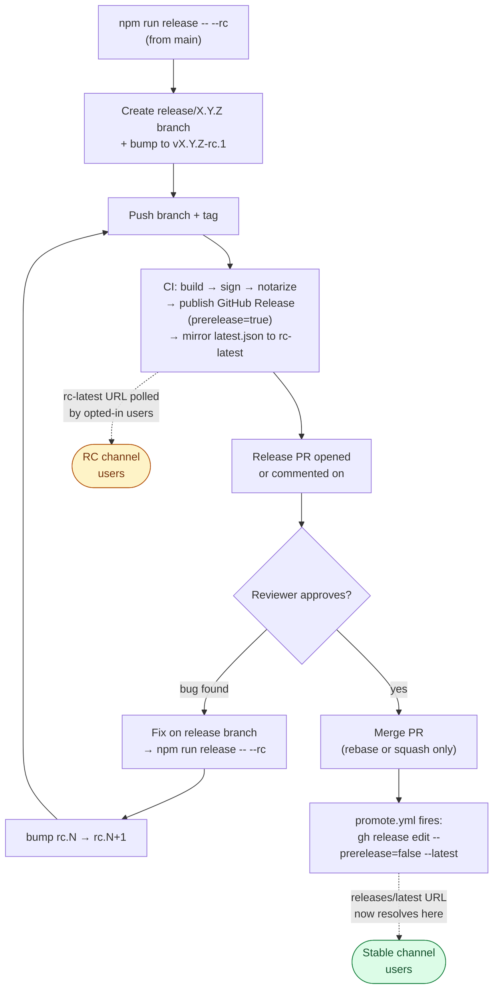

# Development

## Prerequisites

- Rust stable (>= 1.95 — run `rustup update stable` if clippy fails)
- Node.js 18+
- Tauri CLI v2
- Python 3 (optional — only for `huggingface_hub` model downloads)
- Platform-specific build tools:
  - macOS: Xcode Command Line Tools
  - Linux: see [LINUX.md](./LINUX.md)
  - Windows: see [WINDOWS.md](./WINDOWS.md)

## Setup

Install the [Hugging Face CLI](https://huggingface.co/docs/huggingface_hub/guides/cli) (`curl -LsSf https://hf.co/cli/install.sh | bash` on macOS/Linux, `powershell -ExecutionPolicy ByPass -c "irm https://hf.co/cli/install.ps1 | iex"` on Windows), then:

```bash
npm run setup -- --yes
hf download Zyphra/ZUNA
npm run tauri dev
```

## Build

```bash
npm run tauri build
```

## Daemon packaging checks

Validate that release artifacts include the `skill-daemon` sidecar:

```bash
# macOS/Linux auto-detect host OS
npm run test:daemon-packaging

# explicit targets
npm run test:daemon-packaging:mac
npm run test:daemon-packaging:linux
npm run test:daemon-packaging:win
```

Build + verify in one step:

```bash
bash scripts/test-daemon-packaging.sh --os macos --build
bash scripts/test-daemon-packaging.sh --os linux --build
powershell -ExecutionPolicy Bypass -File scripts/test-daemon-packaging.ps1 -Build
```

## Optional build acceleration

```bash
npm run setup:build-cache
npm run setup:llama-prebuilt
```

Environment toggles:

- `SKILL_NO_SCCACHE=1`
- `SKILL_NO_MOLD=1`
- `unset LLAMA_PREBUILT_DIR` (force local llama.cpp build)
- `SKILL_DAEMON_SERVICE_AUTOINSTALL=0` (disable daemon background-service auto-install for local testing)

## Data health check

```bash
npm run health
# or
SKILL_DIR=/path/to/.skill npm run health
```

## Docs/README sync helpers

```bash
npm run sync:readme:supported
npm run sync:readme:supported:check
```

## Testing

### Quick commands

```bash
npm test                   # Interactive picker — shows all suites, pick what to run
npm run test:fast          # fmt + lint + clippy + vitest + rust + ci + types
npm run test:all           # everything including deny, smoke, daemon, e2e
```

### Individual suites

```bash
npm run test:fmt           # cargo fmt + biome format check
npm run test:lint          # biome check (frontend lint)
npm run test:clippy        # cargo clippy (workspace + app)
npm run test:deny          # cargo deny (dependency audit)
npm run test:vitest        # vitest run (frontend unit tests)
npm run test:types         # svelte-check (TypeScript/Svelte)
npm run test:rust          # Rust tier 1 (~5s warm)
npm run test:rust:all      # Rust all tiers (~65s clean)
npm run test:ci            # ci.mjs self-test
npm run test:a11y          # Accessibility audit
npm run test:i18n          # i18n key validation
npm run test:changelog     # Changelog fragment check
npm run test:e2e           # LLM E2E test
npm run test:smoke         # Build verification smoke test
```

### Git hook suites

Run the same checks as the git hooks without committing/pushing:

```bash
npm run test:hooks         # pre-commit + pre-push (full)
npm run test:pre-commit    # Just pre-commit checks
npm run test:pre-push      # Full pre-push suite
```

### Mix and match

```bash
bash scripts/test-all.sh clippy vitest ci       # specific suites
bash scripts/test-all.sh --continue all         # don't stop on first failure
bash scripts/test-all.sh --list                 # show available suites
```

## Git hooks

### Pre-commit

- i18n key sync (when i18n files staged)
- Frontend formatting via Biome
- Rust formatting via `cargo fmt`

### Pre-push

Scoped checks based on changed files:
- Frontend changes: `biome check` + `vitest related`
- Rust changes: `cargo clippy` + `cargo test` on affected crates
- CI changes: `node scripts/ci.mjs self-test`
- Daemon/scripts changes: `vitest run daemon-client.test.ts`

Full mode (runs everything): `PREPUSH_FULL=1 git push`

Emergency bypass:

```bash
git push --no-verify
```

## Versioning

Version strings follow SemVer with an optional `-rc.N` pre-release suffix:

| Version          | Channel | Example          |
|------------------|---------|------------------|
| `x.y.z`          | stable  | `0.5.1`          |
| `x.y.z-rc.N`     | rc      | `0.5.1-rc.3`     |

`bump` is the low-level primitive that mutates version files (`package.json`,
`src-tauri/tauri.conf.json`, `src-tauri/Cargo.toml`), runs preflight (clippy +
tests), compiles `changes/unreleased/*.md` into a versioned release file, and
creates a single commit whose message is the version string itself (this is
load-bearing — see [Promotion](#promoting-rc--stable)).

```bash
npm run bump                  # 0.5.0 → 0.5.1     (next patch, stable track)
npm run bump -- --rc          # 0.5.0 → 0.5.1-rc.1   (start RC track)
npm run bump -- --rc          # 0.5.1-rc.1 → 0.5.1-rc.2   (next RC iteration)
npm run bump                  # 0.5.1-rc.3 → 0.5.2   (start next stable cycle)
npm run bump 1.2.0-rc.1       # explicit version
```

`bump` refuses to run if the current version isn't tagged on a remote — this
catches the "I bumped but forgot to tag" case. Use `--force` to bypass during
recovery.

`tag` creates `v${pkg.version}` and pushes it to every git remote — works
unchanged for both stable and RC versions.

```bash
npm run tag
```

Most of the time you don't run `bump` and `tag` directly: `npm run release`
(below) drives them as part of the PR-based release flow.

## Release

The release pipeline is **PR-driven**. Every release — stable or otherwise —
ships through a release pull request. Cutting the PR publishes a release
candidate; merging the PR promotes the most recent RC to stable. The bytes
shipped to stable users are **byte-identical** to the tested RC — no rebuild,
no re-signing, no re-notarization. Promotion is a metadata flip on the
existing GitHub Release.



### TL;DR — happy path

```bash
# 1. Cut the first RC for the next release (run from main)
npm run release -- --rc

# CI builds, signs, notarizes, and publishes a pre-release on GitHub.
# Users opted into the rc channel auto-update to it.
# A "Release vX.Y.Z" PR is opened by the script.

# 2. Iterate as bugs surface (from the release/X.Y.Z branch)
npm run release -- --rc        # publishes rc.2, comments on the PR

# 3. Approve and merge the PR using rebase or squash merge
#    (the pr-checks workflow comments a reminder on the PR)

# Done. promote.yml fires on the merge commit, flips the most recent RC
# to "latest" on GitHub. Stable users see the new version on their next
# update poll.
```

### `npm run release -- --rc`

State-aware orchestrator (`scripts/release.js`). Invokes `bump`, pushes the
branch, calls `tag`, and creates/updates the release PR. Detects whether
you're on `main` (cuts a new release branch `release/x.y.z`) or already on a
`release/*` branch (iterates).

| Flag         | Meaning                                                        |
|--------------|----------------------------------------------------------------|
| `--rc`       | **Required.** All releases start as an RC.                     |
| `--dry-run`  | Print what would happen; do not modify, push, or open the PR.  |
| `--force`    | Forwarded to `bump` — skips the version-tagged-on-remote check.|

There's no `npm run release` for stable. Stable is what RC becomes after PR
merge. By design.

### Promoting RC → stable

1. The release PR has been built into one or more `vX.Y.Z-rc.N` GitHub
   Releases (each marked `prerelease: true`). RC channel users have been
   pulling them automatically.
2. Reviewers approve the PR.
3. The merger uses **Rebase merge** or **Squash merge** — `pr-checks.yml`
   comments a reminder on every release-labeled PR.
4. The merge commit on `main` carries the version string as its message
   (`bump.js` ensures this). `promote.yml` watches `main`, sees the
   `-rc.` in the commit message, finds the matching tag, and runs:
   ```bash
   gh release edit vX.Y.Z-rc.N --prerelease=false --latest
   ```
5. GitHub's `releases/latest` URL now resolves to that release. Stable
   users get the update on their next background poll.

A regular merge commit would create a different commit hash whose message
doesn't match the version regex — `promote.yml` silently skips, leaving
stable pinned to the previous release. That's why rebase/squash is enforced.

### Update channels

Two URLs serve the Tauri updater manifest:

| Channel | URL                                                                       | Resolves to                                          |
|---------|---------------------------------------------------------------------------|------------------------------------------------------|
| stable  | `https://github.com/.../releases/latest/download/latest.json`             | Most recent **non-prerelease** GitHub Release.       |
| rc      | `https://github.com/.../releases/download/rc-latest/latest.json`          | Mutable `rc-latest` Release that mirrors every build (RC or stable). |

Stable just leverages GitHub's built-in `releases/latest` semantics — no
extra infra. RC uses a long-lived release tagged `rc-latest` whose
`latest.json` asset gets clobbered by each build (the `--mirror-to-rc-latest`
flag on `update-latest-json`). RC users always see the most recent build of
either kind, so a stable release naturally overtakes any in-flight RC.

Users opt into RC via **Settings → Updates → Receive pre-releases**. The
preference lives at `<app_local_data>/update-channel.txt` and is read by:
- The background updater poll (live — toggling takes effect on the next poll)
- The plugin's static endpoint at app startup (manual "Check for updates"
  picks up channel changes after a restart)

### Display version vs. updater version

The `version` field in `tauri.conf.json` is the **updater ordering token**.
After promotion, it may carry an `-rc.N` suffix (because the bytes that ship
as stable were tagged when they were an RC). The user-facing About page
strips the suffix:

| Channel | About displays                  |
|---------|---------------------------------|
| stable  | `v0.5.1`                        |
| rc      | `v0.5.1 (RC · abc1234)`         |

The seven-character commit hash comes from `BUILD_INFO_COMMIT`, baked in by
`src-tauri/build.rs` from `git rev-parse HEAD`. It's the same value across
RC and stable for a given build, so a crash report lets you check out the
exact source state.

### Cheat sheet of the moving parts

| File / workflow                               | Role                                                       |
|-----------------------------------------------|------------------------------------------------------------|
| `scripts/release.js`                          | Orchestrator: branch + bump + push + tag + PR              |
| `scripts/bump.js`                             | Mutates version files, preflight, version-string commit    |
| `scripts/tag.js`                              | `git tag v${pkg.version}` + push                           |
| `scripts/ci.mjs cmdResolveVersion`            | Emits `channel`/`prerelease` outputs for downstream steps  |
| `scripts/ci.mjs cmdUpdateLatestJson`          | Merges `latest.json` per platform; mirrors to `rc-latest`  |
| `.github/workflows/release-{mac,linux,win}.yml` | Build + sign + notarize + publish; tag pattern allows `-rc.N` |
| `.github/workflows/promote.yml`               | Push-to-main → flip prerelease flag on matching tag        |
| `.github/workflows/pr-checks.yml`             | Soft reminder on `release`-labeled PRs to use rebase/squash|
| `src-tauri/build.rs`                          | Bakes `BUILD_INFO_*` env vars from git into the binary     |
| `src-tauri/src/update_channel.rs`             | Channel preference storage, channel-aware updater builder  |

### Hotfix / emergency stable bump

If you genuinely need to skip the RC step (e.g. CVE response), the underlying
primitives still work:

```bash
git checkout main
npm run bump            # creates 0.5.1 commit on main
npm run tag             # publishes a stable release directly
```

This produces a normal stable GitHub Release. There's no RC bake-in window
— if it's broken, you'll be cutting another stable. Prefer the PR flow
unless you have a specific reason.

### Local dry-run (no GitHub interaction)

Test the build pipeline locally without pushing or publishing:

```bash
npm run ci:dry-run             # Full build + bundle + changelog
npm run ci:dry-run:fast        # Skip compile (reuse existing binaries)
npm run release -- --rc --dry-run   # Print what release would do; no mutations
```

### On-demand CI build

All release workflows support `workflow_dispatch` — trigger from the GitHub
Actions UI or CLI. On-demand runs upload artifacts (14-day retention) without
touching the Releases page:

```bash
gh workflow run "Release - Mac"
gh workflow run "Release — Linux"
gh workflow run "Release - Windows"
```

### CI script validation

```bash
npm run ci:test       # Verify ci.mjs commands + workflow references
```
